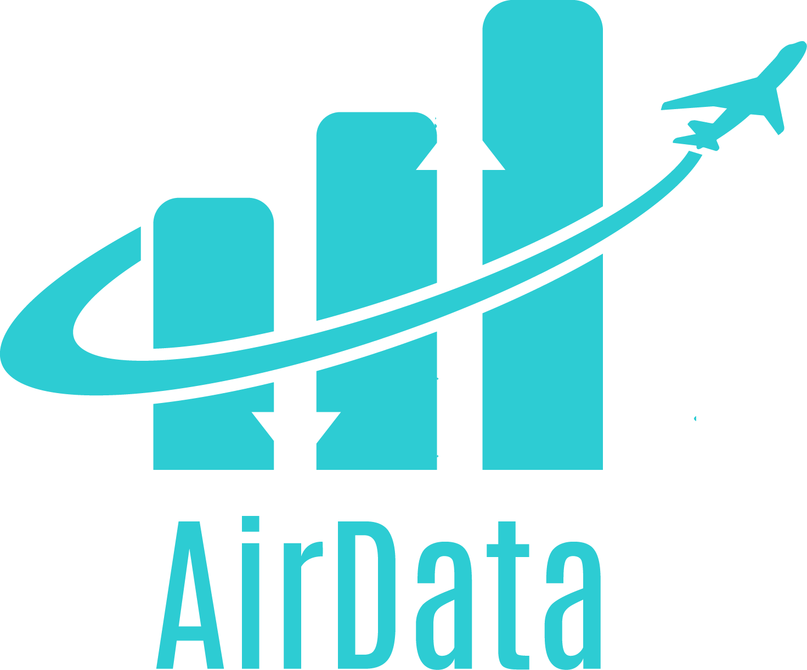

  # AirData - Monitororamento nos sistemas aéreos
Repositório para o desenvolvimento do projeto de Pesquisa e Inovação da SPTECH (2º semestre/2022)

## Equipe 

| [ <small>@GustavoAntonio12</small>](https://github.com/GustavoAntonio12)| [ <small>@CauaCiconelli</small>](https://github.com/CauaCiconelli)  | [ <small>@GuilhermeHenrique525</small>](https://github.com/GuilhermeHenrique525) | 
| :---: | :---: | :---: | 
| [ <small>@GabrielVannucchi</small>](https://github.com/GabrielVannucchi) | [ <small>@kelvinsync</small>](https://github.com/kelvinsync) | [ <small>@leobianchii</small>](https://github.com/leobianchii) 

